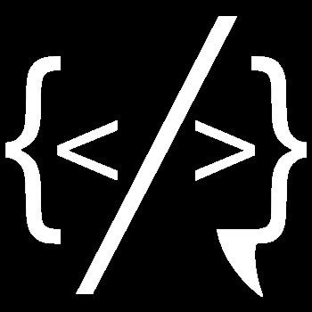

<!-- PROJECT LOGO -->
 

  <!-- <a href="https://github.com/adamtang5/aa_mod4_meme_overflow_project"> -->
    
<!--   [Journium Logo] -->
  </a>

<h3 align="center">Journium</h3>

  

    A clone of Medium
     
    <a href="https://aa-meme-overflow.herokuapp.com/"><strong>Explore the docs »</strong></a>
     
  

<!-- TABLE OF CONTENTS -->

  
Table of Contents

  <ol>
    <li>
      <a href="#about-the-project">About The Project</a>
      <ul>
        <li><a href="#key-features">Key Features</a></li>
      </ul>
    </li>
    <li><a href="#build-with">Built With</a></li>
    <li><a href="#usage">Usage</a></li>
    <li><a href="#contact">Contact</a></li>
  </ol>

<!-- ABOUT THE PROJECT -->
## About The Project

Meme Overflow is a clone of Medium, a website for budding developers in bootcamp and others who support them to write about their experience related to bootcamp, share their tips, comment on their stories, like their stories.

<!--   -->

**Key Features**
* Create new users and have user login with authorization
* Post, edit, and delete stories/comments owned by the current user
* User profile page with stories written by the current user
* Comments page with comments made by the current user
* Liked stories page with stories liked by the current user
* Categories that can be assigned to stories

(<a href="#top">back to top</a>)

<!-- BUILT WITH -->
## Built With

* [React](https://reactjs.org/)
* [Redux](https://redux.js.org/)
* [Javascript](https://www.javascript.com)
* [Express](http://expressjs.com)
* [Sequelize](https://sequelize.org/v5/manual/)
* [PostgreSQL](https://www.postgresql.org/docs/)
* [CSS](https://developer.mozilla.org/en-US/docs/Web/CSS)
* [HTML5](https://developer.mozilla.org/en-US/docs/Glossary/HTML5)
* [Heroku](https://www.heroku.com)

(<a href="#top">back to top</a>)

<!-- USAGE EXAMPLES -->
## Usage

* Users can signup and login to use Journium, and can login as a demo user to experience the website quickly.

<!--   -->

* Once logged in, the user is directed to the main stories page, where logged-in users can view a list of stories based on time created. On the left nav bar, there are icons for home, read stories, likes, write a story, and the avatar for user preferences.

<!--   -->

* On the main stories page, a logged in user can like a story, or save a story to reading list.

<!--   -->

* User can edit profile settings on settings page.

<!--  -->

* Logged in users can search stories by one or multiple keywords based on story title and content.

<!--  -->

(<a href="#top">back to top</a>)

<!-- CONTACT -->
## Contact

Adam Tang - [GitHub](https://github.com/adamtang5)

Project Repo Link: [https://github.com/adamtang5/aa_mod5_w16_express_react_solo](https://github.com/adamtang5/aa_mod5_w16_express_react_solo)

Project Link: [https://aa-meme-overflow.herokuapp.com/](https://aa-meme-overflow.herokuapp.com/)

(<a href="#top">back to top</a>)

